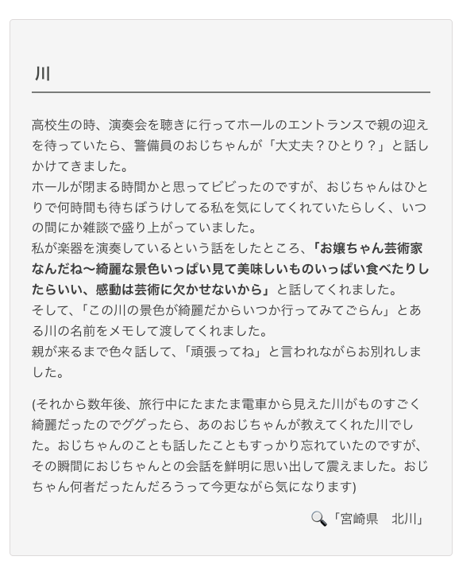
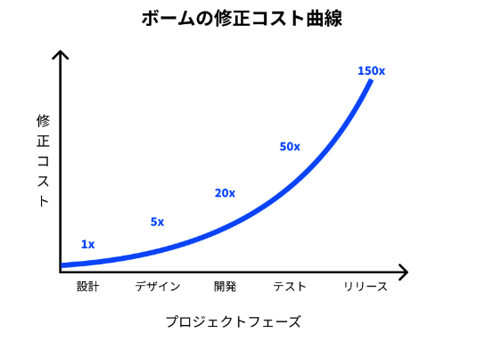

# 生活

- [汁気の多いおかずに！保存袋の脱気方法に「簡単で完ぺき」「煮卵にいいかも」](https://macaro-ni.jp/159701)  
  なにかの角に袋を押し付けて、角で空気をぬいていくのだとか。覚えておこう。
- [そこそこ健康な89歳｢共同生活を選んだ｣深い理由](https://toyokeizai.net/articles/-/835432)  
  グループリビングという概念らしい。ちょっとした縛りごとのもと各々一人暮らしをしていくという。
- [「紙の保険証も使えるようにする」--議席増の立民・野田代表、優先政策の1つに](https://japan.cnet.com/article/35225398/)  
  普通に考えたら、批判されるのはわかっているのだろうな。それはそれとして、多分なんだけど、現行の保険証の廃止が課題なのであって、紙かどうかは問題ではないのかもしれないのかな。
- [中年になって『人間失格』病にかかるの話](https://blog.tinect.jp/?p=88018)  
  自分は黄色の滝みたいな表現があったところを覚えていた。他人に対する幻滅というか、普通の人だったな気づく感触を言い当てられた気がしていた。
- [連続強盗｢家族が生き残る家｣の特徴と"10の武器"](https://toyokeizai.net/articles/-/836754?page=5)  
  流しておこうと思ったけど、最後の見出しはすごい大事だと思った。  
  > 武器は相手を攻撃することを目的としない
- [｢実家の片付け｣で親とモメないための大鉄則](https://toyokeizai.net/articles/-/834284?utm_source=rss&utm_medium=http&utm_campaign=link_back)  
  相手の価値観を否定しないを身に付けたい。だれだって大事にしたいことはあるだろう。
- [知らん人と一度きり会話した思い出集6](https://omocoro.jp/kiji/479758/)  
  おもしろい。また読みたい。  
  
  - [ホームレス女性「ハルさん」の話](https://blog.tinect.jp/?p=88044)  
    たくさんのものを無くしてしまった人が、支援を求めない、みたいな気持ちは想像できる気がする。
- [急騰した卵価格｢物価の優等生｣は､今は昔か？](https://toyokeizai.net/articles/-/835595)  
  また卵が高いらしい。たしかに、あまり数を見かけなくなった印象がある。猛暑に起因するらしく、年末にかけて、上昇か高止まりなのだとか。輸出も伸びているらしい。
- [罰則なかった自転車の酒気帯び運転、11月から「罰金50万円」に--ほう助にも厳罰](https://japan.cnet.com/article/35225556/)  
  11月かららしい。気をつけよう。
# 仕事

- [個人開発マネタイズ大全](https://zenn.dev/nabettu/articles/013f114c7a1b44)  
  作ったサービス、対象となるユーザに適したマネタイズを選びましょうってのは当たり前だけど、ちゃんとやるにはちと難しいな。おぼえておこう。
- [Webエンジニアになる人に知っておいて欲しい最低限のWebの技術](https://qiita.com/yamadagenki/items/11947222fd162e45dd27)  
  ざっくり見出しだけまとめておく。
    - DNSサーバーの役割
    - サーバーの3層構造
      - プレゼンテーション層
      - アプリケーション層
      - データベース層
    - URLの詳細
      - ドメイン・サブドメイン
      - パスパラメータ
      - クエリパラメータ
    - HTTPリクエスト・HTTPレスポンス
    - GETとPOST
      - GET
        - データがURLに含まれる（アドレスバーなどに見える）
        - リクエストボディがない（？）
        - サーバーの状態を変更しない
        - URLの長さに制限がある
        - 読み込み専用の操作
      - POST
        - リクエストボディにデータを含む
        - サーバの状態を変更することがある
        - 大容量のデータを送信できる
        - 認証や機密データの送信に使われる
        - 長さに制限がない
  - [データ分析は命を救うこともあれば、命を奪うこともある](https://yuzutas0.hatenablog.com/entry/2024/10/30/121916)  
    ナイチンゲールってそういう感じの有能な人だったんだ。すごいなぁ。
- [アクセシビリティに取り組まないと、企業はどれくらい「損」をする？　試算する方法をご紹介](https://goodpatch.com/blog/2024-10-accessibility-cost)  
  それはそれとして、この画像は実感としてあるし、名前がついていたんだな。  
    
- [生成AIを“自社業務に特化”させて使いこなすために　「業務利用するには回答精度が低い」真因と成果に向けた具体的ステップ：生成AI、期待する回答にいかに近づけるか](https://www.itmedia.co.jp/enterprise/articles/2410/28/news001.html)  
  RAG（Retrieval-Augmented Generation：検索拡張生成）という名前がついているらしい。データベースの蓄積がないとあまり関係はない。

# 趣味

## デザイン

## 読書

- [フラガールと戦争――＃８　ミルトン・ムラヤマ『俺が欲しいのは自分の体だけ』（１）](https://nhkbook-hiraku.com/n/n3deba0a32781)  
  ハワイなり、沖縄なり、あるいは他の場所もきっとそうだろうけど、忘れるべきでない過去があるんだろうな。この間、岐阜空襲の前後の岐阜市の写真を見た。
  - > 残念ながら、ミルトン・ムラヤマは本書の日本語への翻訳を拒み続けており、その状況は彼の死後も変わってはいない。こうした日本について深く考えさせられる作品が、日本語の世界からは見えない形で存在し続けていることは興味深い。
- [哲学は17世紀が面白い！ 刺激的な「近世合理哲学」入門](https://nhkbook-hiraku.com/n/n3bdc4f7a1e3c)  
  おもしろそう。「哲学者たちのワンダーランド」。

## 制作

- [JavaScript でスタイルシートを構築する CSSStyleSheet](https://azukiazusa.dev/blog/cssstylesheet-to-build-stylesheets-in-javascript/)  
  タイトルの通り。できることはわかけど、使い方がわからない。また、わからない用語が多い。JSにおけるインターフェース・API・コンストラクター・メソッド・ShadowDOMなど。
- [mask-compositeでつくるCSSの新しい表現方法](https://ics.media/entry/241025/)  
  覚えておこう。マスクは何かと便利そう。svgの色変えとかした使い方が手元にないけど。
- [国立国会図書館サーチのAPIをつかって得た、検索APIと書影APIの知見](https://zenn.dev/chot/articles/24ea6186c029b0)  
  書影をAPIで取得する唯一の方法らしい。
## ガジェット

- [かまどの美味しさを最先端の技術で追求。【今日の逸品】](https://casabrutus.com/categories/food/426377)  
  炊飯器がダメになったら、バーミキュラのライスポット、ありかな。4万円。中のポットだけでも買えるらしい（高い）。
- [もはやカメラの「AQUOS R9 Pro」ほぼハイエンドの「AQUOS sense9」、シャープが新スマホ2機種を発表](https://www.goodspress.jp/news/636825/2/)  
  悪かないな。アップル製品のデメリットって、過去のソフトウェアとの互換性が乏しいと、高いと、なんだろう。便利なのはエコシステム。
- [M4／M4 Pro搭載で手のひらサイズに小型化したMac miniが2024年11月8日(金)に登場、価格は税込9万4800円から](https://gigazine.net/news/20241030-apple-m4-pro-mac-mini/)  
  Type-Cで給電と映像の出力、できるんかな。
## アウトドア

- [ココヘリの補償はどこまで？山岳保険との違いやおすすめの契約セットを解説](https://yamahack.com/6384)  
  意外と安い。年間で5,500円。山岳保険をつけても年額10,000円を超えないのだとか。世の中よくできていますなぁ。
- [なぜ定年を控えたおじさんは歩き出すのか？](https://www.bepal.net/archives/480857)  
  > 昔、カヌーイストの野田知佑さんが言いました。「ミヤカワ、齢をとるとな、花を見ても雲を見ても、しみじみ美しいなあって感動するんだ（笑）。若いうちはそんなもんに感動しないだろう。たぶん自分の生命力が弱ってきて、まわりの生命力がきらきらと輝いて見えるのだろうな」

## 展覧会

## お勉強

## 豆知識

- [5.25インチフロッピーを用いたシステムの廃止などに約1000億円を投入、サンフランシスコ市交通局](https://internet.watch.impress.co.jp/docs/yajiuma/1634315.html)  
  システムの更新とかメンテナンスって、こつこつやるべきだよな。それができるのであれば苦労はないのだけど。
- [脱亜入欧に没頭し西欧を超えられなくなった日本](https://toyokeizai.net/articles/-/835900?page=5)  
  何か似たような話を読んだな。岸田前総理がなにかの演説をするときに、西欧的価値観との別離を仄めかしたとか。東南アジアの時代になっていくのだろうか。
- [なめる／なめられる　についての話](https://p-shirokuma.hatenadiary.com/entry/20241029/1730199195)  
  おもしろい。
  - > 周囲の人間になめられていると、軽んじられ、不平等を押し付けられ、搾取される可能性が高くなる。自己主張はもちろん、業務連絡すらうまく伝わらない・伝えられなくなるやもしれない。
  - > ストレスを感じる状況、つまり副腎からコルチゾールやアドレナリンが分泌される状況とは、生存や生殖にかかわるクリティカルな状態が専らだから、なめられたらストレスを感じるということは、なめられることが生存や生殖にとって致命的だったことを示唆している。
# お金儲け