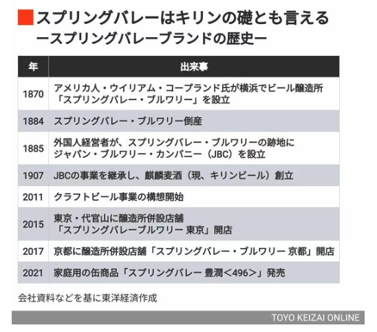
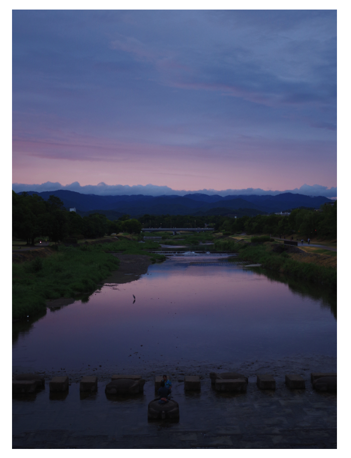
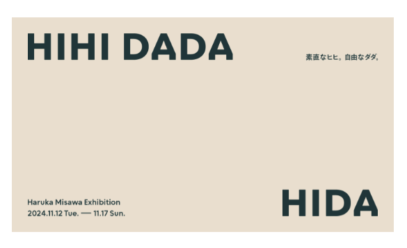
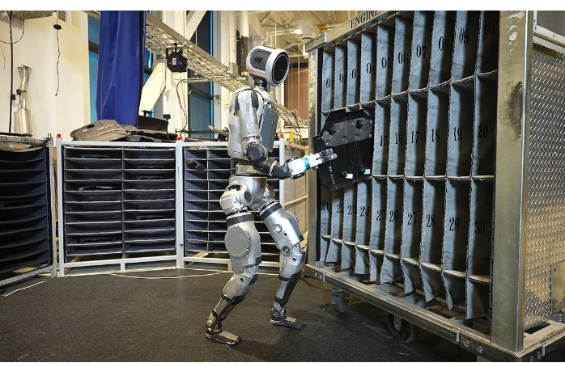

# 生活

- [総務省の“アップルつぶし”か　スマホ下取り価格規制](https://ascii.jp/elem/000/004/231/4231933/4/)  
  下取り価格を任意に設定できることで、うまく買い替え需要を支えていたところに手が入るのだとか。キャリアで数年ごとに買い換える、みたいなところからは降りているのであまり影響はないけど、端末の価格が上がらないと嬉しい。
- [治安はこれから悪くなるに違いない。](https://blog.tinect.jp/?p=88067)  
  世代間の分断は本当に良くないとは思う。年収ごとの税収額にびっくりしたけど、実際のところを知っていかないといけないんだろうな。
- [キリンの｢クラフトビール｣が苦戦､10年目の大反省](https://toyokeizai.net/articles/-/835762?page=3)  
  スプリングバレーのいわれを知らなんだ。京都に醸造所があるらしい。
  
- [オードリー・タンの「5年間ビデオ会議した結果、微妙な情報の変化がわからず、相手を夢の中の人みたいに扱う。直接のやり取りは必要」に共感した話…VTuberでもあるある](https://togetter.com/li/2459275)  
  たしかに、瞬間的な変化に気づけなくなるというか、情報量は格段に減るよな。その点、自分がテキストのコミュニケーションが楽だと思うのは、気持ちが乗りすぎないからなのかな。
- [文章を読むことが苦手になっていく](https://blog.3qe.us/entry/2024/11/02/044339)  
  思っていた内容と少し違うけど、驕りと焦りはたしかに、共感できる。たまに読む紙の本の豊かさよ。
- [黄色い涙を流す幼女を看取った母の闘病手記](https://toyokeizai.net/articles/-/837101?page=10)  
  これは悲しいな。どうしようもできない子供の心情を想像してしまう。
- [｢地元に住めない｣2度の災害に襲われた人の現実](https://toyokeizai.net/articles/-/837479)  
  これもしんどいな。仮想住民はいいアイディアなのかな。交通網とコストが問題か。個人的には。逆スケーリング、やれたらいいけど、本当に難しいだろうな。
- [岐阜でおいしいチャーハンを食べたので家で作ってみた（違うものができた）](https://dailyportalz.jp/kiji/sancock-chanan-tsukuru)  
  サンコック、稲葉チャーハンというやつがうまいらしい。ワイ君は担々麺が好き。
- [やみつき！タロイモの世界［前編］日本でタロイモスイーツが楽しめる店3選](https://80c.jp/column/20241031-1.html?utm_source=rss&utm_medium=rss&utm_campaign=20241031-1)  
  里芋はタロイモらしい。台湾のものはとくに独特の甘い香りがするのだとか。
- [「マイナ免許証」の運用開始日は2025年3月24日　閣議で正式決定](https://www.itmedia.co.jp/mobile/articles/2410/29/news149.html)  講習の受講が簡単になるのと、住所変更が一発で終わるらしい。デメリットがなければこっちがいいな。カードはダサい。
- [2024年の衆議院議員総選挙はひどいものだったなあと思った](http://finalvent.cocolog-nifty.com/fareastblog/2024/10/post-042148.html)  
  なるほどなぁと思った。こういう状況を裏で糸を引いているものの一つが、地域の衰退なのか。  
  > これを機会に自民党は公明党と連携を切って、政策面から新しい政党政治を模索するきっかけになってくれればいいと思う。国家の防衛、エネルギー保障、移民問題、少子高齢化、こうした問題はポピュリズムでは扱えない。責任ある政党が存在しないといけない。がんばってくれ、有志。
# 仕事

- [「桜井政博のゲーム作るには」は非常に低い確率が何層も重ならないと実現できないチャンネルだった──桜井さんに直接聞いた、YouTubeを始めたわけ、動画制作の手順、まだ誰も気づいていない動画内の秘密](https://news.denfaminicogamer.jp/interview/221228a/3)  
  [収益はゼロ、費用は9000万、もう完全にボランティア……なのに、なぜ「桜井政博のゲーム作るには」を作り続けられたのか。最終回を迎えた桜井さんにお聞きする、「この番組を見た人たちにとって、大事なこと」とは](https://news.denfaminicogamer.jp/interview/241105s/4)  
  とんでもない人だなぁ。これはファンになっちまう。人生のリソースをだぶつかせない、ってのは見習いたいけど、生半可なことじゃないな。ビートやND、現行のA110が好きらしい。これも好感がもてる。炭水化物の量を控える。

# 趣味

- [2024-11-04](https://akarusa.hatenablog.com/entry/2024/11/04/074656)  
  素晴らしい写真。
   

## デザイン

- [秋の褒章786人・26団体　デザイナーの原研哉さんら](https://www.nikkei.com/article/DGXZQOUE319XQ0R31C24A0000000/)  
  まことにおめでたい。緑綬褒章とか藍綬褒章（それぞれなんて読むんだろ）の人たちは継続して社会に貢献してる人たちなんだろうな。
- [ふつうをおもしろがる天才。](https://www.1101.com/n/s/sobue_sakuramomoko/2024-11-06.html)  
  祖父江慎に聞いた、さくらももこの話。神のちからおもしろらしい。あとはエッセイ。みんなおすすめだというけど、読んだことないなぁ。
- [三澤遥がデザインした新作椅子「HIHI」「DADA」を紹介する展覧会が開催](https://www.axismag.jp/posts/2024/11/623710.html)  
  なんだ東京かよ〜。2年くらいのプロジェクトらしい。  
  
## 読書

## 制作

## ガジェット

- [ついに来るのか!?拡散言語モデル](https://note.com/shi3zblog/n/nf98f1af25512)  
  スティブルディフュージョンはたしかに、ローカルでも動かせるらしいけど、そういうことだったのね。これを言語にも転用できるかもという。事後学習のコストが低い？。わかんらない単語（事前学習・事後学習・拡散モデル）。
- [人に近づいたら作業ロボになってしまった｢アトラス｣](https://www.gizmodo.jp/2024/11/bostondynamics_atlas.html)  
  すげぇじゃん！と思ったけど、作業用ロボットは他にも開発されているという点が抜けていた。一度引退していたらしい。  
  
## アウトドア

## 展覧会

- [柚木沙弥郎　永遠のいま](https://www.japandesign.ne.jp/event/yunokisamiro-ima/)  
  なくなっていたのか。知らなかった気がする。巡回するなら見てみたいな。
## お勉強

## 豆知識

- [地球はこれまで考えられていたよりはるかに巨大な宇宙の構造「引力流域」の一部との研究結果](https://gigazine.net/news/20241102-cosmic-mega-structures-basin-of-attraction/)  
  まさしく天文学的な数字の話題。銀河<局所銀河群<超銀河団<引力流域（？）という構造であるかもとか。宇宙は広がっているけど、それとともに広がった物質がもともとあった場所があると想像して、その場所から広がったものがある領域、みたいな理解でいいのかな。
- [わずか200g程度で1本の木と同じだけの二酸化炭素を吸収できる粉末が開発される](https://gigazine.net/news/20241103-carbon-dioxide-capture-powder/)  
  排出量を減らすということそのものと、排出してしまったものを回収するという、両輪が必要なのだとか。それは頭になかった。
- [地球滅亡の日に備えて、科学者は月面に貯蔵庫をつくろうとしている](https://wired.jp/article/sz-scientists-want-to-build-a-doomsday-vault-on-the-moon/)  
  あの有名な「スヴァールバル世界種子貯蔵庫」が洪水に見舞われていたのか。知らなかった。それで、月の南極にあらたな貯蔵施設を建設する計画があるらしい。月の南極はずっと夜なのかな。
# お金儲け