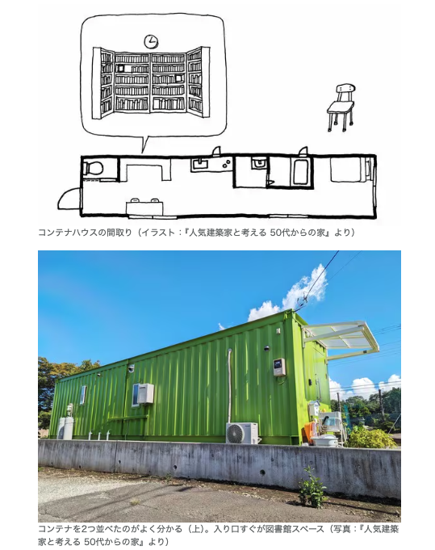
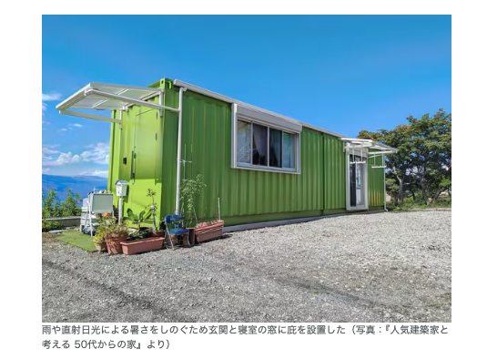
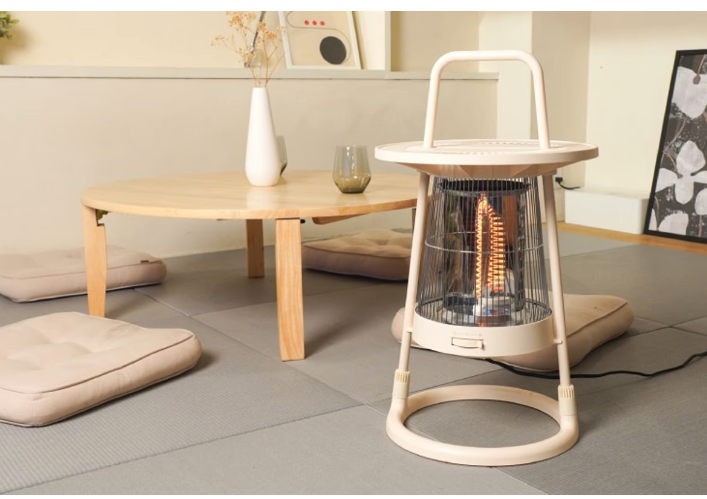
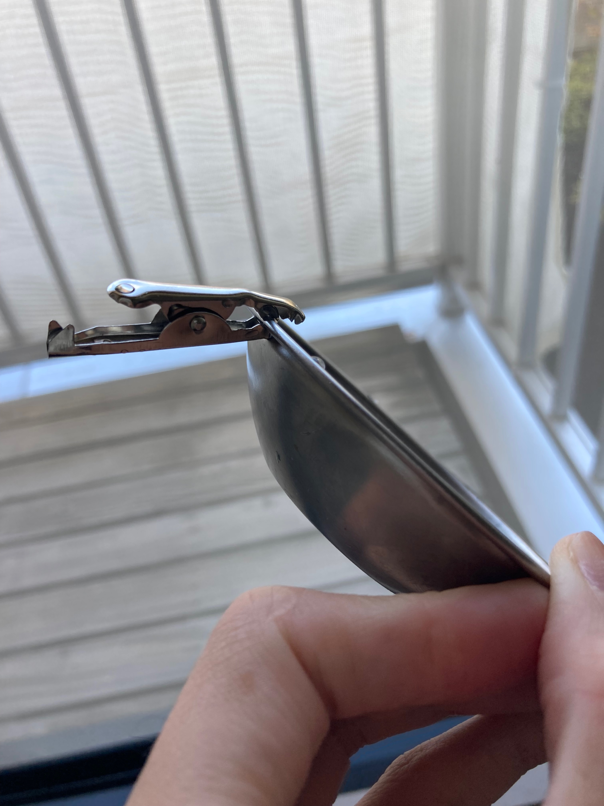

# 生活

- [｢日本で魚が獲れない理由｣を知った小学生の驚愕](https://toyokeizai.net/articles/-/838602?page=4)  
  実際に漁獲量が改善している事例もあるんですね。ノルウェーのお話だけど。20年は長いなぁ。
- [【漫画】フライパンってどれくらい使って捨てますか？](https://omocoro.jp/bros/kiji/481103/)  
  こういうもの、捨てらんないよなと思って、中華鍋使っているけど、使う油の量が多かったり、洗剤が多かったりすると節約にもならないのか。
- [肉だねで手がベタベタ。速くきれいになる洗い方を試した結果「こんなに差が出るとは」「一発で消えた」](https://macaro-ni.jp/160806)  
  砂糖で手を揉むといいらしい。
- [母校にて](https://note.com/shi3zblog/n/n1599209f7c17)  
  真心は大事。たしかに。これがコンピュータに模倣される時が来ても、尽くした真心は消えない（だろう）から。
- [世界は必然的に多極化する](http://finalvent.cocolog-nifty.com/fareastblog/2024/11/post-4d14f1.html)  
  らしい。わからないけど。日本などの立場は戦略的曖昧性とせつめいされるのだとか。
  > 米国主導のリベラルな国際秩序が見直され、「ユーラシア型多極秩序」への移行が加速するという博士の分析には、私も同意せざるを得ない。  
- [人口減でも｢マンション家賃10％上昇｣のなぜ](https://toyokeizai.net/articles/-/838526?page=4)  
  人口数で考えるのではなく、世帯数で考えると、説明できるらしい。この発想はなかった。
- [｢非ミニマリスト｣の89歳､モノを捨てない住まい方](https://toyokeizai.net/articles/-/835783)  
  ものとの関係性って難しいなぁ。大事なものが増えすぎないように、ものを増やさないようにするのは拗れているな。
# 仕事

- [ドメイン名の終活について - JPAAWG 7th -](https://speakerdeck.com/mikit/domeinming-nozhong-huo-nituite-jpaawg-7th?slide=3)  
  ドメインの後始末って、思っているより大変そう。多少なりともアクセスがあったものだと特にリスクが高いんだなぁ。

# 趣味

- [秋、安曇野ちひろ美術館を訪れる](https://blog.tinect.jp/?p=88128)  
  よさそうな美術館だな。窓ぎわのトットちゃん、読んでみたい。

## デザイン

- [2人世帯向け3Dプリンター住宅の1号棟が能登・珠洲市内で竣工　「生活再建のイメージに」](https://www.itmedia.co.jp/news/articles/2411/07/news159.html)  
  セレンディクスの家が一棟貸しの宿泊施設になるらしい。ちょっと行ってみたい。そういう用途ではなさそうだけども。
- [学園祭で日本の生産性の低さのルーツを見た](https://blog.szk.cc/2024/11/05/the-roots-of-japans-low-productivity/)  
  近頃無限にみかける言葉。  
  > いまの時代、ビジョンさえあればツールは後からいくらでもついてくるのだから。
- [奥行き12m｢カステラハウス｣工夫満載の快適空間](https://toyokeizai.net/articles/-/837131?page=3)  
  コンテナハウス、二箱で、1,500万ほどかかるらしい。工務店はどこなんだろう。
  
  

## 読書

## 制作

- [CSSだけでスタイルクエリのサポートを確認する方法、Safari 18のバグを回避する方法も](https://coliss.com/articles/build-websites/operation/css/detect-style-queries-support-in-css.html)
  ```
  html {
  --sentinel: 1;}
  @container style(--sentinel: 1) {
  body { --supported: ;}
  }
  ```
スタイルクエリが機能するか判定できるのだとか。  
> スタイルクエリがサポートされているブラウザでは、--supportedは空の値になります。サポートされていないブラウザでは、--supportedは無効な値（初期値）、スペーストグルになります。
- [CSSで文節の折り返しを！br・wbrとauto-phraseの活用術](https://ics.media/entry/241105/)  
  開業してもいいよ（`<wbr/>`）やCSSの`word-break: auto-phrase;`、BudouXなどの方法で実現できるらいし。Web Componentsというやつが便利らしい。
  ```
  <!-- CDNからライブラリを導入 -->
  <script src="https://unpkg.com/budoux/bundle/budoux-ja.min.js"></script>
  <!-- budoux-ja タグが利用できる -->
  <budoux-ja>ジョバンニは、口笛を吹いているようなさびしい口付きで、･･･（省略）</budoux-ja>
  ```
- [これでCSSのみで実装できる！ スクロール方向に合わせてヘッダを非表示・表示する方法を解説](https://coliss.com/articles/build-websites/operation/css/css-hide-header-when-scrolling-down.html)  
  CSSでスクロール方向を検知できるらしいけど、いつ使おう？また、いまいちわかっていない書き方があるぞ。CSSアニメーションや@propertyなど  
## ガジェット

- [M4搭載「Mac mini」は本当に手のひらサイズでパワフル！ コスパも良し](https://ascii.jp/elem/000/004/233/4233283/2/)  
  動画のデコード云々の記述があったけど、こういうのはわからないよなぁ。わかるようになりたいかな？
- [「Amazonにはびこる劣悪USBハブにうんざりした」という理由で開発されたRaspberry Pi公式USBハブを分解してみた、かなり頑丈な作り＆ホスト不要で充電も可能](https://gigazine.net/news/20241108-raspberry-pi-usb-3-hub/)  
  2,000円くらいで作りがいいらしい。usb2と3が混在すると、遅くなるのは仕様だと思っていたけど、どうも製品によるらしい。
- [東芝がNTO負極リチウムイオン電池で新技術、容量はLFP並みで超急速充電寿命は10倍](https://monoist.itmedia.co.jp/mn/articles/2411/07/news099.html)  
  電気自動車や蓄電用のバッテリーはこれからもどんどん良くなるんだろうな。リン酸鉄リチウムイオン電池より高速充電への耐性があるらしい。
- [2段階ではありません。3段階です。](https://anond.hatelabo.jp/20241105235825)  
  しらなんだ。結構怖いな。  
  > 悪いのは「貼り付けた」行為なんすね。ディズニーを傷つけたのは生成AIのモデルを学習させた人ではなく、手元で生成した人でもなく、ネットに貼って公表した人になる。
- [この可愛いヒーター、ミニテーブルにもなってさらに可愛い](https://www.gizmodo.jp/2024/11/thanko_heater.html)  
  300wでも使えて、悪くないかも。
  
## アウトドア

- [2021/08/22 ■ 81円でチタンマグがドリップポットに大変身（ワニ口/ミノムシクリップで注ぎ口をつくるの巻）](https://blog.mobilehackerz.jp/2021/08/81.html)  
  つくった。
  

## 展覧会

## お勉強

## 豆知識

- [石油はなぜ枯渇しないのか？　石油無機起源説の検証](https://nazology.kusuguru.co.jp/archives/164178)  
  ほんとかな。地球の中心部付近では、石油や天然ガスが作られる条件が揃っているらしいことや、原料となる生物がいなかった時代の地層からも石油が算出する事例があることを根拠に調べているらしい。
- [Googleのめっちゃ当たる｢天気予報ソフト｣](https://www.gizmodo.jp/2024/11/google-launches-ai-weatherman-graphcast-jpn-1.html)  
  シミュレーションではなく、従来の方法を用いた天気予報のデータをもとに、過去の事象と照らし合わせ、今後起こりうる天気を類推するみたいなことをしているらしい。
- [大西洋の重要な海流に崩壊の危機が迫っている](https://www.gizmodo.jp/2024/11/global-catastrophe-looms-as-key-ocean-current-nears-collapse-experts-warn.html)  
  前にも読んだ気がする。大西洋南北熱塩循環（AMOC / Atlantic Meridional Overturning Circulation）というらしい。
- [ミトコンドリアは単なる細胞小器官ではなく「生命」だと科学者が考える理由とは？](https://gigazine.net/news/20241112-mitochondria-are-alive/)  
  生命を細胞に取り込んだは、前提で、現在考えられている生命の定義に当てはまるのではないか？という議論だった。これに当てはめて、遺伝子学的な研究が進むと、老化に伴う脳の炎症やパーキンソン病についての理解が進むかも、という。
# お金儲け