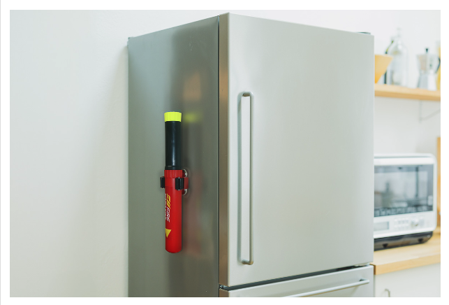

# 生活

- [｢寿命を決める臓器=腎臓｣機能低下を示す兆候5つ](https://toyokeizai.net/articles/-/835661)  
  背中の痛みには気をつけろと言われる所以ですね。、「ホメオスタシス（生体恒常性）」、覚えられない言葉。
- [AIの女の子がわいわい競馬予想するシステムを個人展示したら倍率2000倍の馬券が当たってしまった (1)設計思想編](https://qiita.com/oktamajun/items/34c2287a9f4d9ac9c298)  
  こつこつ当てていったのかと思ったけど、万馬券（ではないけど）だったのだとか。生成AIに何かを考えさせたい時に、役に立ちそうなことがたくさんかいてある。
- [使い終えたApple Watchを処分するには？　iPhoneと同様にリサイクルできる？](https://www.itmedia.co.jp/mobile/articles/2411/18/news049_2.html)  
  アップルストアか、リネットジャパンが回収してくれるらしい。
- [iOS 18.1に搭載された「非アクティブ時再起動」機能の仕組みをリバースエンジニアリングで解明](https://gigazine.net/news/20241119-reverse-engineering-ios-inactivity-reboot/)  
  我が家のインターネットがたまに止まりそう。  
- [12月2日に保険証廃止、「マイナ保険証」未所有どうなる？--今後は「なければ手続きできない」システム増へ](https://japan.cnet.com/article/35226267/)  
  思ってるより不便な面がありそうだな。とはいえ、この辺りは時間が解決していきそう。  
- [ドコモに「いざという時のために両親のスマホの名義を変えておくと良いですよ」と言われ、父の委任状を持って店に行ったら「無効」と言われた話](https://togetter.com/li/2467659)  
  元気なうちにやった方がいいことらしい。その発想はなかった。
- [とある知事選挙とスティーブ・ジョブズと「オメラスから歩み去る人々」](https://fujipon.hatenablog.com/entry/2024/11/19/132956)  
  最近、身近な体験として、考え込んで、あとはいつも通り一人になった。つまり歩み去ったわけだけど、考えずにはいられないけど、答えが出るわけでもないよな。  
- [インターネットで民主主義が加速して良かったですね]  
  こわいよ。集団の維持に優れた指導者が必要であるならば、東側の国々は次にどんな指導者を選ぶのだろう。属人は避けられないのだろうか。スマブラの新作は出るのだろうか。
  - [エリートたちには「縦の旅行」が足りない](https://blog.tinect.jp/?p=88276)  
    アッ、マイルドになった！のかな。自分の小学校時代はギリギリだったと思う。地方だしね。また、自分だったらこういう状況をエコーチャンバー！としか言えないのだろうな。
- [｢ダウンは必要？｣この先どれくらい寒くなるのか](https://toyokeizai.net/articles/-/841306?page=5)  
  1〜2月は平年並み、つまりは昨年より寒いらしい。
# 仕事

# 趣味

- [ソニーがKADOKAWAを買収交渉中という報道に対する海外の反応、「ELDEN RING」を作った子会社フロム・ソフトウェアの取得が主目的ではと騒がれる](https://gigazine.net/news/20241120-kadokawa-sony-acquire/)  
  フロムがプレイステーション限定タイトルを作ったりするのかなぁ。昔はそうだったんだけども。PC版、おなしゃす！

## デザイン

## 読書

- [ChatGPTを読書の味方にする](https://baigie.me/nippo/2024/11/18/chatgpt_yamazaki/)  
  なんのために読書をするのかという話題でもあるなぁ。確かに、身に付かなければ実利としては薄いのだろうけど。
- [【読書感想】あのころなにしてた？](https://fujipon.hatenadiary.com/entry/2024/11/18/083819)  
  ちょっと読みたいかも。小説はあまり耐性がないから難しいけど、エッセイは好き。  
  > 人は特別な状況にいると、その特別さをあれこれ語りたくなって、「それ以外の日常」は置き去りにされてしまう。（中略）　子どもの頃、ふだんのご飯のメニューって、どんなものだっただろう？　母親の得意料理や、たまに出かけたレストランのハンバーグは思い出せるけれど、「ふつうのご飯」は、すぐに記憶からこぼれ落ちてしまう。

- [「お金じゃないよ。大事なのは人だよ」と、田内学さんは何度も語る。](https://www.1101.com/manabu_tauchi/index.html)  
  「きみのお金は誰のため」の作者の話。お金があっても...は確かに想像してしまう。他者との付き合い方を上手にしたいな。
## 制作

## ガジェット・グッズ

- [反射板×ファンで温かさ広がる。どことなく懐かしい見た目も愛着湧くね！](https://www.goodspress.jp/news/640352/2/)  
  反射板とファンで消費電力に対して、効果が高いのだとか。なんらかの選び方があるのかもしれない。
- [Wi-Fiルーターの「見直し」ついでにココも要チェック！　不要になっても放置されがちな設定項目](https://internet.watch.impress.co.jp/docs/column/shimizu/1639044.html)  
  一通り確認したけど、問題ないっぽい。自宅で使っているミニルーター、結構すぐれものなのかもしれない。
- [「VRAM」～マンガでプログラミング用語解説](https://codezine.jp/article/detail/19935?p=5)  
  ヴィデオランダムアクセスメモリー、GPU用のメモリーらしい。
- [無害なガスで部屋を汚さず消火！コンパクトな“ショーカスティック”でいざに備える](https://www.goodspress.jp/news/641101/2/)  
  不活性ガスを吹き付けて、燃焼を止めるらしい。２万円こえるなり。  
  
  - [充電式湯たんぽのおすすめ5選！充電式のメリット・デメリット、選び方を紹介](https://www.bepal.net/archives/484647)  
    悪くないのかも。15分ほどの充電で、5時間前後使えるのだとか。
## アウトドア

- [登山用ガスバーナー10選！初めてのバーナー選びのポイントを徹底解説](https://yamahack.com/177)  
  OD・CBは中身のガスも違うらしい。知らなんだ。

## 展覧会

## お勉強

## 豆知識

- [1181年に日本の歴史書に記された超新星の一部がゾンビ星となり花火のような形状に](https://karapaia.com/archives/466718.html)  
  1181年に記録があった[客星](https://ja.wikipedia.org/wiki/%E5%AE%A2%E6%98%9F)は超新星爆発に由来するもので、どうもその残骸が不思議な形で残っているらしいのだとか。Iax型超新星というらしい。
- [動物も光合成できるようになったら、脱炭素社会がぐっと近づいてくる](https://www.gizmodo.jp/2024/11/photosynthesis-in-animals.html)  
  記事のタイトルがあまり良くない。世の中の培養細胞でよく使われるのがハムスター卵巣から作られたのもの（GHO細胞）らしい。それに、葉緑体を取り込ませたうえ、活動の継続を確認できたのだとか。酸素と炭素を供給することができるっぽいので、培養細胞の成長に寄与するかもだとか。
- [深刻なプラスチック汚染､生産自体に総量規制を](https://toyokeizai.net/articles/-/841472?page=4)  
  プラスチックに含まれる添加剤と、それを放出しながら広がるマイクロプラスチックが問題になるらしい。今もそういうかは知らないけど、環境ホルモン的に作用したりするのだとか。なので、生産総量を減らそうという提言らしい。
# お金儲け