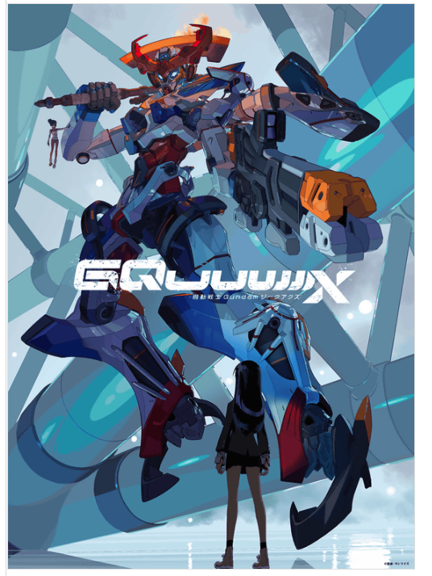
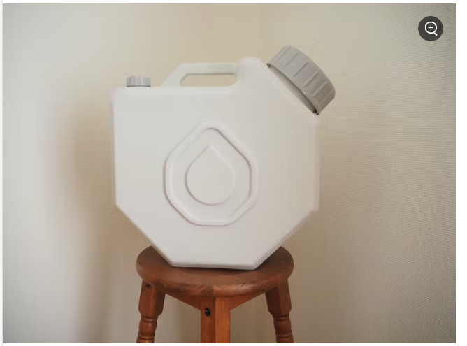

# 生活

- [｢妻が死んでくれた｣と動画配信した67歳の暮らし](https://toyokeizai.net/articles/-/842935)  
  一通り読んで、しんみりして、メモしておこうと思ったらタイトルが回収されていなかったような気がする。どういうことや。
- [ハンター・バイデン氏への恩赦](http://finalvent.cocolog-nifty.com/fareastblog/2024/12/post-d4fff7.html)  
  アメリカの世論がウクライナに対して厳しいなぁとかって思っていたけど、こういう背景があるのか。来年とかちょっと怖いなぁ。
- [HPVワクチンが「子宮頸がん」予防にどれだけ効果的がわかるデータが公開される、「日本のメディア」名指し批判も](https://gigazine.net/news/20241201-hpv-vaccination-world-cervical-cancer/)  
  身近な人には受けておいて欲しい。一緒に行こうかと思ったらとんでもない金額だった覚えがある。
- [そういえばどうなった「NTT法廃止」の議論--急先鋒が落選で総務省が論戦にケリ（石川温）](https://japan.cnet.com/article/35226751/)  
  しれっと結構恐ろしいことが書いてあるな。ここにもわからない世界がある。
  
# 仕事

- [「バカのフリ」ができる人間は、本当に強い。](https://blog.tinect.jp/?p=88365)  
  聞くべきことを聞ける人でありたい。やるべきことも。むずかしいなぁ。 

# 趣味

- [ガンダムシリーズ新作「機動戦士Gundam GQuuuuuuX(ジークアクス)」特報映像公開、サンライズ＆スタジオカラーが初タッグでTV放送に先駆けて劇場上映も決定](https://gigazine.net/news/20241204-gundam-gquuuuuux/)  
  なんだこの山下いくとみたいな絵は！とおもったらほんとにそうだった。かっこいいね。見れたらみよう。  
  

## デザイン

## 読書

- [【読書感想】いのちの車窓から 2 ☆☆☆☆](https://fujipon.hatenadiary.com/entry/2024/12/02/085005)  
  今週借りてくる本、これにしようかな。我らが星野源。

## 制作

- [なぜ僕はデザイナーの作ったデザインを「見づらい」と感じてしまうのか](https://yuheiy.com/2024-12-01-i-am-not-a-visual-thinker)  
  ちょっとわかるような気がする。「見づらい」はもしかしたら適切な言葉ではないのかも。レイアウトやタイポグラフィに関心があって、手の込んだビジュアルに興味が薄いのも、この記事のように説明できる気がした。とはいえ、視覚依存な傾向もあるような感じがする。
- [長い処理には通知音コマンドを仕込んでおくと捗るぞ](https://zenn.dev/magicmoment/articles/play-sound-command-20241205)  
  たしかに。コマンドラインで音を鳴らせられてちょっとたのしい。`afplay/System/Library/Sounds/Ping.aiff`
## ガジェット・グッズ

- [2024年11月、いまさら中古のiPhone13に機種変更した話](https://note.com/sugina_kazuaki/n/n8b5274c5c396)  
  自分も最近同じような理由で13miniを購入した。肝心の5Gの挙動がよくわからない、

## アウトドア

- [【防災士愛用】無印良品の防災グッズおすすめ11選。日常から使える優秀アイテムが勢ぞろい](https://macaro-ni.jp/161131?page=2)  
  防災用品をぶち込むようにこの水タンクいいかも。  
  

## 展覧会

## お勉強

## 豆知識

- [ブラックホールの邪悪な双子的存在「グラヴァスター」とは一体何なのか？](https://gigazine.net/news/20241204-black-hole-evil-twin-gravastar/)  
  重力の崩壊と膨張するエネ離ギーが釣り合うと、内部に極端に何もなく冷たい硬い殻ができるのだとか。理屈の上では。観測するのが難しい存在らしい。

# お金儲け