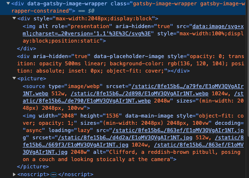

# やったこと

- 2024-08-27
  - gatsbyのチュートリアルを進める
    - Reactのpropsはコンポーネント同士のプロパティのやりとりに使う
      - 静的な場合は`{props.名前{}`もしくは`{名前}`
      - クラスの場合は`{this.props.名前}`
    - JSのアロー関数とは
        - ES6以降にサポートされたfunctionを宣言する方法
        - `var func = function(hoge){console.log(hoge);}`と`var func =(hoge) => {console.log(hoge);}は同じ意味になる`
- 2024-08-31
  - gatsbyのチュートリアルを進める
    -   
    かなり最適化された形で画像を挿入してくれるみたい
    - GraphQLさわる
      - [http://localhost:8000/___graphql](http://localhost:8000/___graphql)でアクセスできるやつはgraphiQLというらしい
- 2024-09-02
  - seoコンポーネントを作った  
    なんとなくやれることが理解できた
    - export const Headではheadの中身に任意の情報を取り込むことができる
    - コンポーネント化することで、出力したい内容を任意に作成することができる
  - [入っているプラグインについて](https://px-wing.hatenablog.com/entry/2021/01/19/065523)
    - gatsby-transformer-remark  
      マークダウンファイルを解析する（remarkを使用する）
    - gatsby-source-filesystem  
      デフォルトで入っている。ローカルファイルシステウからgatsbyアプリケーションにデータを取り込む？
  - mdとmdx  
    mdxはマークダウンをreactにおいてjsとして扱えるようにしたものらしい。直近はあまり人気がないのか日本語のドキュメントの更新が少ない。なのでmdでやろうと思う。
  - `${__dirname}`  
    node.jsの変数で、実行ゆうのファイルを含むディレクトリの絶対パスが格納されている
    - gatsby-configに限らずだけど、jsで""の中などに変数を使用する場合は``に変更する必要がある
  - pagesの中のjsでgraphqlにクエリを投げると、dataの中に格納される（仕様？）  
    →[gatsbyのAPIらしい](https://www.gatsbyjs.com/docs/reference/built-in-components/gatsby-head/)
  - gatsby-plugin-imageを使用してオンライン上の画像を静的なコンテンツとして取り込んだ時、allFileのnodeに含まれる
  - src/componentsにでデータをひきこむときにはuseStaticQueryを使う
  - src/pageにデータを引き込む時にはページクエリをつかう
- 2024-09-03
  - gatsbyチュートリアルを進める
    - queryを触る
      - nodeとは結節の意味でファイルごとの切れ目とかの意味で使っているのかな
      - excerptを指示すると文字通り要約を返してくれる
      - プラグインごとにnodeが作成される
      - トランスフォーマープラグインは、既存のnodeをトランスフォームする？
- 2024-09-04
  - gatsbyのチュートリアルを進める
    - FileSystemRouteAPIを使う
      - ページを生成するためのnodeを選ぶ
      - ページのルートで使用するnodeのフィールドを選ぶ
      - ページコンポーネントをつくる（`src/page`）名前は{nodeType.field}.jsで命名すること
        -  `{}`はルートの動的な処理を指示できる
      - GraphQLのクエリ変数
        - ` mdx(frontmatter: { slug: { eq: "another-post" } }))`でスラッグが"another-post"のフィールドを呼び出せる
        - `{eq: $slug}`で変数を指定できる
      - {nodeType.field}.jsを作成すると、自動でいくつかの変数がページコンポーネント内で生成される
        - {}で指定したフィールドが同じ名前の変数に代入される（？）
        - そのフィールドのidが$idに代入される（？）
      - [markdownRemarkからhtmlを呼び出すには](https://zenn.dev/yuukis234/articles/1aa7b196b27b58)  
        - `dangerouslySetInnerHTML={{ __html: html }}`をつかう（普通に変数として読み出すと無害化されるので）
          `
`のようになんらかの要素の中で使用しないとエラーになる（？）
        - タグとかコンポーネントの中で変数を使いたい時は`{`/blog/${node.frontmatter.slug}`}`
        - フォルダの構造が変わると再起動する必要がある
      - gatsby-transformer-sharp 
        - 画像ファイル（.jpg、.png、.tiffなど）のノードを作成する（？）
      - gatsby-plugin-image
        - getImageでnodeからイメージの情報をとりだす？
        - GatsbyImageでレイアウトをする
      - チュートリアル終わり
